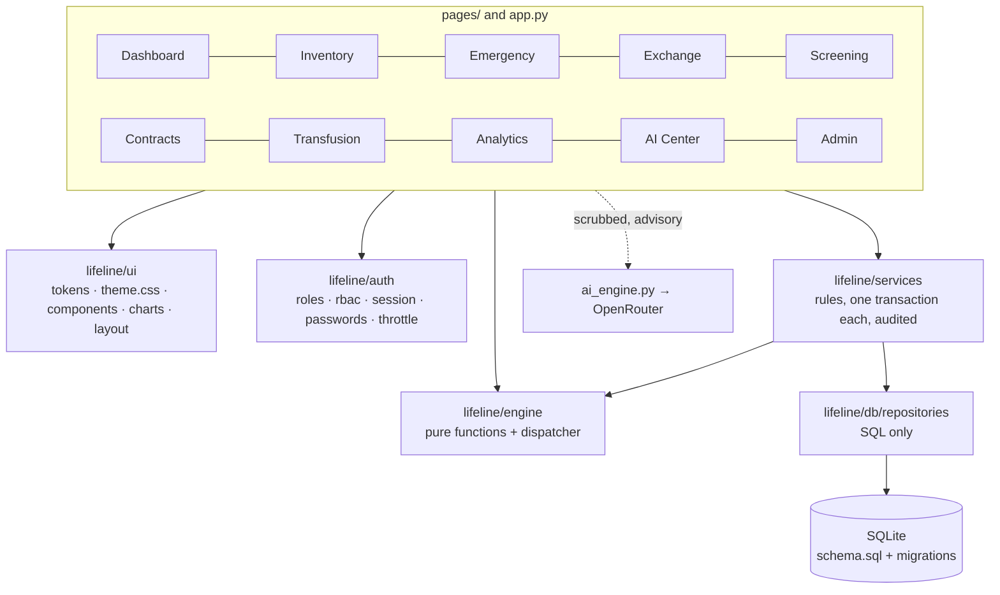
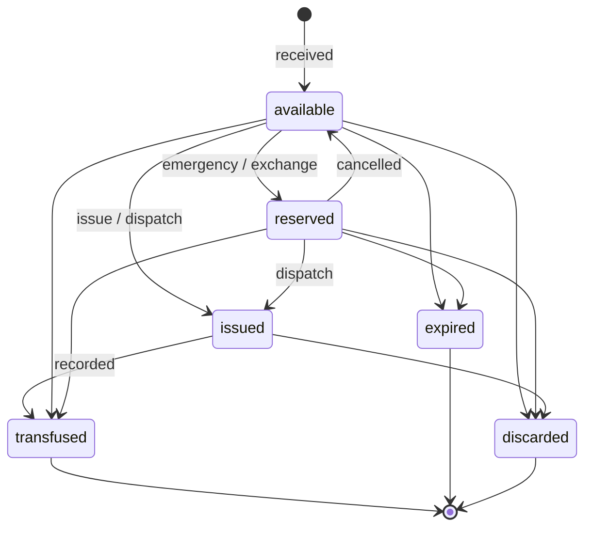

# Architecture

LIFELINE is a Streamlit app over SQLite, organised in layers that only call downward. The rule that keeps it
maintainable: **a page never writes SQL, a repository never makes a decision, and the engine never touches I/O.**

## Layers

| Layer | Path | Responsibility | Must not |
|---|---|---|---|
| Pages | `pages/`, `app.py` | Layout, input, showing results; call services and the engine | contain SQL or business rules |
| Design system | `lifeline/ui/` | Tokens, two WCAG-AA themes, components, chart theme, the page shell (`page()`, `guard()`) | hard-code a colour outside `tokens.py` |
| Auth | `lifeline/auth/` | Passwords, login throttle, roles, per-page and per-call authorisation, idle timeout | trust the UI to hide a button |
| Services | `lifeline/services/` | Validate → open **one** transaction → change data → write the audit row → commit | leave a half-done state |
| Engine | `lifeline/engine/` | Routing, screening, forecasting, … as pure functions on plain data | read the database or the clock |
| Repositories | `lifeline/db/repositories/` | One SQL statement per function | decide anything |
| Database | `lifeline/db/` | `schema.sql` (fresh DBs), numbered migrations, connection factory | be edited by hand |

`utils/database.py` is a small read-side adapter that gives the pages the row shapes they use; every write goes
through `lifeline/services`.

## Data model

One row per **unit of blood** (`blood_units`) — a count column cannot say which unit was issued, when it expires or who
holds it. Stock is *derived*: available units with `expiry_date >= today`.

The state machine is enforced twice — `ALLOWED_TRANSITIONS` in Python and the trigger `trg_units_state_machine` in
SQLite — and a test walks all 36 (from, to) pairs to prove the two agree.

Other tables: `hospitals`, `users`, `login_throttle`, `donors`, `blood_requests`, `exchanges`, `contracts` (hospital to
hospital loans), `transfusions`, `screening_tests`, `inventory_events` (the ledger every forecast is built from),
`audit_logs`, `ai_logs`, `migration_rejects`.

Integrity is in the database, not only in Python: `CHECK`s on blood group, status, urgency and unit counts, foreign
keys, 24 indexes, WAL mode, unit blood group and expiry date immutable (triggers), and an append-only audit log
(update and delete are blocked by triggers).

### Concurrency: why a unit cannot be issued twice

`transaction()` opens `BEGIN IMMEDIATE`, which takes the write lock up front, and every status change is a guarded
`UPDATE … WHERE status = 'available'` whose row count is checked. Two people racing for the same unit: one wins, the
other gets a clear "no longer available" error. A test starts six threads against one unit and asserts exactly one wins.

### The atomic emergency

`services.emergency.create_and_reserve` validates, creates the request, audits it and reserves every planned unit
(earliest expiry first) in **one** transaction. If any source fell short a moment ago, nothing is written and the user
is told to search again. There is no state in which a request exists with only some of its blood reserved.

### Migrations

Numbered SQL files applied in order, tracked with `PRAGMA user_version`. `schema.sql` creates fresh databases and a
test asserts a fresh database and a fully migrated one have the identical shape. Before the first migration of a
database a `<db>.bak-v<N>` copy is written; rows that cannot satisfy the new constraints go to `migration_rejects`
instead of being dropped.

## Security

| Concern | How it is handled |
|---|---|
| Passwords | bcrypt (cost 12), 8–72 byte policy; legacy SHA-256 hashes still verify and are upgraded on the next login |
| Brute force | 5 failures → 15-minute lock, per email, **including unknown emails** (so responses do not reveal which exist); stored in the DB |
| Sessions | 30-minute idle timeout; an expired session fails closed |
| Authorisation | `require_page` on every page (a page missing from the table is closed) and `authorize_hospital` inside every service call |
| Audit | Login, failures, denials, and every data change: actor, action, entity, before/after JSON, PKT (+05:00) timestamp, in the same transaction as the change |
| Secrets | `pydantic-settings` + `SecretStr`; never rendered or logged; log lines are redacted for API keys, bcrypt hashes, CNIC, phone, email |
| Personal data | CNIC masked on screen; the AI receives only "Patient N" pseudonyms and allow-listed, scrubbed fields — tests capture the outgoing HTTP body and search it for every real name and identifier in the database |
| Demo conveniences | Demo accounts are shown only when `APP_ENV=demo` |
| Errors | `guard()` turns an unexpected exception into a friendly message with a reference id; the traceback goes to the log, never the screen |

## User interface

- **Tokens** (`ui/tokens.py`) are the only place colours, spacing, type and radii live. `theme.css` uses `$placeholder`
  tokens substituted per theme, so dark and light are one stylesheet.
- **Contrast** is a test: every text/background pair the theme uses must meet WCAG AA in both themes.
- **Blood groups** never rely on colour alone: the label is always printed, Rh-negative is outlined and Rh-positive is
  filled, and the palette is colour-blind-safe (Okabe–Ito). Charts add hatching for Rh-negative bars.
- **Statuses** carry a glyph and a word as well as a colour.
- **Irreversible actions** (issue, dispatch, cancel, discard, record transfusion, lend, return) use a two-step confirm.
- **Every page** has empty, error and (where slow) loading states; forms validate inline as you type.
- Layout is checked at 1440×900 (dashboard fits without scrolling), at tablet width, and in both themes.

## AI

`ai_engine.py` is optional and advisory. Without an API key the AI Center says "AI is off" and disables its buttons. A
failed call is shown as a warning, never as advice, and is not logged as an answer. Every real answer is labelled
"AI suggestion — verify clinically" and logged in `ai_logs`. The deterministic engine result is always shown next to it
and is what the system acts on.

The AI client itself (retries, rate limiting, response caching) has not been rewritten; see the CHANGELOG.

## Observability and health

- `lifeline/logging_setup.py`: JSON lines to the console and a rotating file, PKT timestamps, redacted.
- **Admin → System self-test** (`lifeline/selftest.py`) runs every engine operation against a fixture with a hand-checked
  answer and checks database integrity, foreign keys, schema version and unit statuses.
- CI (`.github/workflows/ci.yml`) runs ruff, mypy and the test suite with a 90 % coverage floor on `engine/` and `auth/`.
- A test enforces the page-load budget: every page renders in under 1.5 s on the demo data.

## Decisions worth knowing

| Decision | Why |
|---|---|
| SQLite only; Supabase removed | One file, zero setup, transactions and triggers for integrity. The old Supabase code was dead and referenced modules that no longer existed |
| Per-unit ledger instead of counts | Only way to know *which* unit, its expiry and its history; makes FEFO, double-issue protection and audit possible |
| Pure-Python engine, no numpy / scikit-learn | The data is tiny; fewer dependencies, deterministic results, and each algorithm is readable and testable |
| No `st.cache_data` | Measured render times are 0.03–0.1 s per page; a cache would add invalidation bugs for no visible gain. Revisit if the data grows |
| Step navigation with button callbacks | One render pass per click, and "Back" keeps what the user typed |
| Clinical thresholds in one file | `engine/thresholds.py`, mirrored by `docs/CLINICAL_REFERENCE.md`; a test fails if they disagree, so a clinician can review the document and know it is the code |
