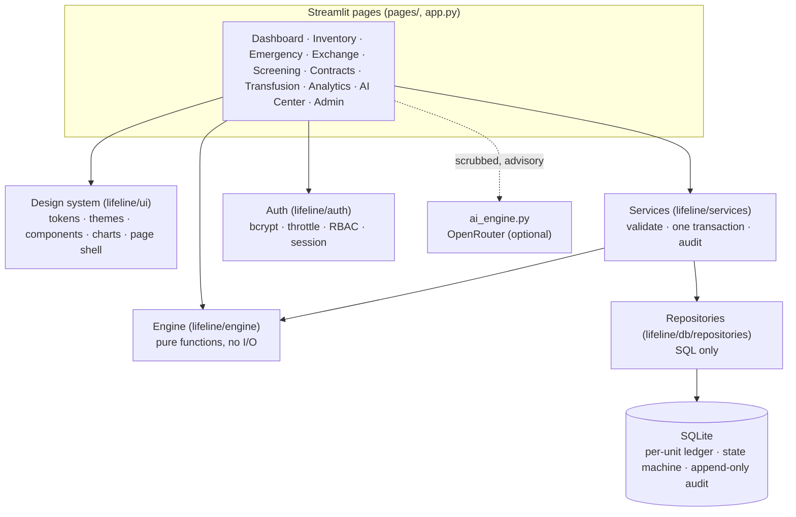

# LIFELINE — Intelligent Blood Logistics Network

A blood bank system for a network of Lahore hospitals: track every unit of blood, find the nearest **compatible**
supply in an emergency, lend and borrow between hospitals, screen donors, watch transfusions for reactions and see
shortages coming before they happen.

Streamlit + SQLite, pure Python (no numpy, no scikit-learn, no cloud database). AI features are optional.

> **Decision support, not a medical device.** The screening and reaction rules use *proposed* clinical thresholds
> that a clinician has not yet approved — see [docs/CLINICAL_REFERENCE.md](docs/CLINICAL_REFERENCE.md). Do not use the
> system on real patients or donors until a medical officer has reviewed them.

## Quick start

```bash
pip install -r requirements.txt
python -m scripts.setup_db          # creates the database with demo data
streamlit run app.py
```

Windows: double-click `run.bat`. With `make`: `make setup && make run`. With Docker: see [Deployment](#deployment).

Open <http://localhost:8501>. To see the demo accounts on the login page, put `APP_ENV=demo` in `.env`
(copy `.env.example` first). Fresh demo data at any time: `python -m scripts.setup_db --reset`.

## What you can do

| Page | What it is for |
|---|---|
| **Dashboard** | Stock per blood group, open emergencies, units expiring in 72 h, loans due — on one screen |
| **Inventory** | Stock, first-expired-first-out dispatch order, receive units, issue units, discard a unit |
| **Emergency** | Three steps: patient and need → ranked compatible sources with the road route → confirm. The request and every reservation are saved together or not at all |
| **Exchange** | Ask another hospital for blood; they accept, then the units move. Suggested transfers between shortages and surpluses |
| **Screening** | Donor registry (CNIC shown masked), registration, and a screening test that reports *every* rule that fired |
| **Contracts** | Loans between hospitals with a return deadline; overdue loans flag themselves |
| **Transfusion** | Record a transfusion (ABO/Rh compatibility enforced) and check pre/post vitals for a reaction |
| **Analytics** | Demand forecast, shortage outlook, donor segments, the hospital road network |
| **AI Center** | Advisory AI on top of the engine: forecast commentary, triage, assistant, anomaly scan, exchange strategy |
| **Admin** | Users, hospitals, the audit log, AI usage and a **system self-test** |

## Roles

| Role | Sees | Can do |
|---|---|---|
| **Super Admin** | Every hospital | Everything, including user management and the self-test |
| **Hospital Admin** | Their own hospital (plus the network for routing) | Everything for their hospital: dispatch, cancel, lend, AI Center |
| **Staff** | Their own hospital | Day-to-day work: receive/issue stock, record transfusions, screen donors, raise emergencies. Cannot dispatch, cancel, lend or open the AI Center or Admin |

Access is checked on every page load and again inside every service call, and each denial is written to the audit log.

## Demo accounts

Shown on the login page only when `APP_ENV=demo`. Every demo account uses the password `lifeline123`.
**Never run a real deployment in demo mode.**

| Email | Role | Hospital |
|---|---|---|
| `admin@lifeline.com` | Super Admin | all |
| `mayo@lifeline.com` | Hospital Admin | Mayo Hospital |
| `services@lifeline.com` | Hospital Admin | Services Hospital |
| `mayo.worker@lifeline.com` | Staff | Mayo Hospital |

(There are 11 in total; the rest follow the same `<hospital>` / `<hospital>.worker` pattern — see `lifeline/demo.py`.)

For a real deployment use `APP_ENV=prod`: the database is created with hospitals only, no demo users, and you create
the first administrator with `python -m lifeline.auth.create_admin`.

## Architecture in one picture



More detail: [ARCHITECTURE.md](ARCHITECTURE.md) (layers, data model, security) and [ALGORITHMS.md](ALGORITHMS.md)
(the 13 engine operations with complexity and where each is used).

## Configuration

Copy `.env.example` to `.env`. Everything has a safe default.

| Variable | Default | Meaning |
|---|---|---|
| `APP_ENV` | `dev` | `dev`, `demo` (shows demo accounts) or `prod` |
| `DB_PATH` | `lifeline.db` | SQLite file |
| `OPENROUTER_API_KEY` | empty | Enables the AI features. Without it the AI Center says so and everything else works |
| `SESSION_TIMEOUT_MINUTES` | `30` | Idle sign-out |
| `LOGIN_MAX_ATTEMPTS` / `LOGIN_LOCKOUT_MINUTES` | `5` / `15` | Login throttle, per email (unknown emails too) |
| `BCRYPT_ROUNDS` | `12` | Password hashing cost |
| `LOG_LEVEL` / `LOG_FILE` | `INFO` / `logs/lifeline.log` | JSON-lines log, rotated; secrets and personal identifiers are redacted |

## Working on it

```bash
make check         # ruff + mypy + pytest, exactly what CI runs
make test          # tests only
make lint          # ruff
make types         # mypy
```

Without `make`: `python -m ruff check .`, `python -m mypy`, `python -m pytest`.

The suite has about 580 tests: unit, engine (including brute-force checks of all 64 ABO/Rh pairs and Dijkstra against
Floyd–Warshall), a concurrency test (six threads racing for the same unit), and page-level tests that drive the real
Streamlit widgets and assert on the database. `engine/` and `auth/` are held at 90 % coverage in CI (currently 99 %).
Every page must render in under 1.5 s on the demo data (measured: 0.03–0.1 s).

### Project layout

```
app.py                     sign-in page
pages/                     the ten pages, each a thin layer over services and the design system
lifeline/
  config.py                typed settings (pydantic-settings), secrets never rendered
  auth/                    passwords (bcrypt), throttle, roles, RBAC, session
  db/                      schema.sql, numbered migrations, connection, repositories (SQL only)
  services/                the business rules: validate, one transaction, audit
  engine/                  the algorithms: pure Python, no I/O, one dispatcher
  ui/                      design tokens, themes, components, charts, page shell
  privacy.py               CNIC masking and the scrubber applied before anything is sent to the AI
  selftest.py              the checks behind Admin → System self-test
  logging_setup.py         redacted JSON logging
scripts/                   setup_db.py (create / migrate / reset), seed_demo.py (deterministic demo data)
tests/                     unit/ engine/ integration/ ui/
docs/CLINICAL_REFERENCE.md every clinical cut-off, checked against the code by a test
AUDIT.md                   the original audit and the status of every finding
```

## Deployment

```bash
docker build -t lifeline .
docker run -p 8501:8501 -v lifeline-data:/data lifeline
docker exec -it <container> python -m lifeline.auth.create_admin     # first administrator
```

The container runs with `APP_ENV=prod` (no demo users) and keeps the database and logs in the `/data` volume. Add
`-e APP_ENV=demo` to try it with demo data. The image has not been built in CI yet.

## Things that need a person

- **Rotate the OpenRouter key** in your local `.env`: the audit found it in plain text on disk (it was never committed to git).
- **Clinical sign-off** of `docs/CLINICAL_REFERENCE.md`, including two deliberate changes: syphilis now *defers* a donor
  (the old code said BLOCK while its message said "defer until treated") and blood thinners defer a donor.
- Hospital coordinates and the ABO/Rh mix in the demo seed are approximations.

## Troubleshooting

| Symptom | Fix |
|---|---|
| "Database not found" on start | `python -m scripts.setup_db` |
| Demo accounts are not on the login page | Set `APP_ENV=demo` in `.env` and restart |
| Dashboard shows everything expired | An old database: `python -m scripts.setup_db --reset` for fresh demo data |
| AI Center says "AI is off" | Set `OPENROUTER_API_KEY` in `.env`; everything else works without it |
| Locked out after failed logins | Wait `LOGIN_LOCKOUT_MINUTES` (the lock is stored in the database, so restarting does not clear it) |
