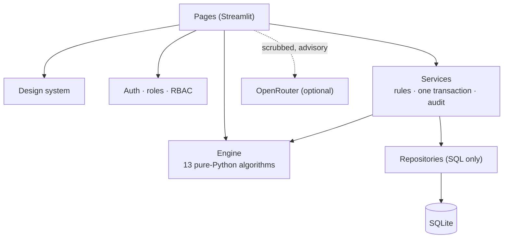

# 🩸 LIFELINE

**Intelligent blood logistics for Lahore's hospital network.**
Track every unit of blood, find the nearest *compatible* supply in an emergency, lend and borrow between hospitals,
screen donors, watch transfusions for reactions, and see shortages before they happen.

[](https://github.com/hani-k07/lifeline/actions/workflows/ci.yml)


> **Decision support, not a medical device.** The screening and reaction rules use *proposed* clinical thresholds that
> no clinician has approved yet ([docs/CLINICAL_REFERENCE.md](docs/CLINICAL_REFERENCE.md)). Do not use LIFELINE on real
> patients or donors until a medical officer has reviewed them.

## Features

- **Per-unit blood ledger** — every unit has its own status, expiry and history. A unit can never be issued twice.
- **Emergency workflow** — a three-step flow that ranks compatible sources by road distance (exact group first, O− last)
  and reserves the blood atomically: the request and every reservation are saved together or not at all.
- **Hospital exchange and loans** — request, accept, complete; loans with return deadlines that flag themselves when overdue.
- **Donor screening and transfusion monitoring** — every rule is evaluated and every reason shown; a missing measurement is never assumed normal.
- **Forecasting and analytics** — demand forecast from real usage, shortage outlook, donor segments, road network map.
- **Optional AI assistant** — advisory only, labelled as such, and never sent a patient name or ID.
- **Secure by default** — bcrypt, login throttle, idle timeout, role checks on every page and every action, append-only audit log.
- **Accessible UI** — dark and light themes that meet WCAG AA, colour-blind-safe blood-group badges, responsive down to tablet.

## Quick start

```bash
pip install -r requirements.txt
python -m scripts.setup_db        # creates the database with demo data
streamlit run app.py
```

Then open <http://localhost:8501>. On Windows you can double-click `run.bat` instead.

To show the demo accounts on the login page, copy `.env.example` to `.env` and set `APP_ENV=demo`.

### Demo accounts

Password for every account: `lifeline123` (shown only when `APP_ENV=demo`; never run a real deployment in demo mode).

| Email | Role |
|---|---|
| `admin@lifeline.com` | Super Admin — all hospitals |
| `mayo@lifeline.com` | Hospital Admin — Mayo Hospital |
| `mayo.worker@lifeline.com` | Staff — Mayo Hospital |

Eleven accounts in total; see `lifeline/demo.py`.

## Roles

| Role | Scope | Can do |
|---|---|---|
| **Super Admin** | Whole network | Everything, including users and the system self-test |
| **Hospital Admin** | Own hospital | Everything for their hospital: dispatch, cancel, lend, AI Center |
| **Staff** | Own hospital | Receive and issue stock, record transfusions, screen donors, raise emergencies |

## How it fits together



Pages never write SQL, repositories never make decisions, the engine never touches I/O.
Details: [ARCHITECTURE.md](ARCHITECTURE.md) · algorithms and complexity: [ALGORITHMS.md](ALGORITHMS.md) · history: [CHANGELOG.md](CHANGELOG.md).

## Configuration

Copy `.env.example` to `.env`. Every setting has a safe default.

| Variable | Default | Meaning |
|---|---|---|
| `APP_ENV` | `dev` | `dev`, `demo` (shows demo accounts) or `prod` (no demo users) |
| `DB_PATH` | `lifeline.db` | SQLite file |
| `OPENROUTER_API_KEY` | *(empty)* | Turns on the AI features; everything else works without it |
| `SESSION_TIMEOUT_MINUTES` | `30` | Idle sign-out |
| `LOGIN_MAX_ATTEMPTS` / `LOGIN_LOCKOUT_MINUTES` | `5` / `15` | Login throttle |
| `LOG_LEVEL` / `LOG_FILE` | `INFO` / `logs/lifeline.log` | Redacted JSON logs |

## Development

```bash
make check      # ruff + mypy + pytest, exactly what CI runs
```

No `make`? Run `python -m ruff check .`, `python -m mypy` and `python -m pytest`.

About 580 tests cover the engine (all 64 ABO/Rh pairs, Dijkstra against Floyd–Warshall), a six-thread double-issue race,
and every page through the real Streamlit widgets. `engine/` and `auth/` are held at 90 % coverage in CI. Every page
must render in under 1.5 s.

## Deployment

```bash
docker build -t lifeline .
docker run -p 8501:8501 -v lifeline-data:/data lifeline
docker exec -it <container> python -m lifeline.auth.create_admin     # first administrator
```

The container runs with `APP_ENV=prod` and keeps the database and logs in the `/data` volume.
*The Docker image has not been built in CI yet.*

## Before real use

- Rotate any OpenRouter key that has been stored in a local `.env`.
- Have a clinician review and sign off `docs/CLINICAL_REFERENCE.md`.
- Hospital coordinates and the blood-group mix in the demo data are approximations.
